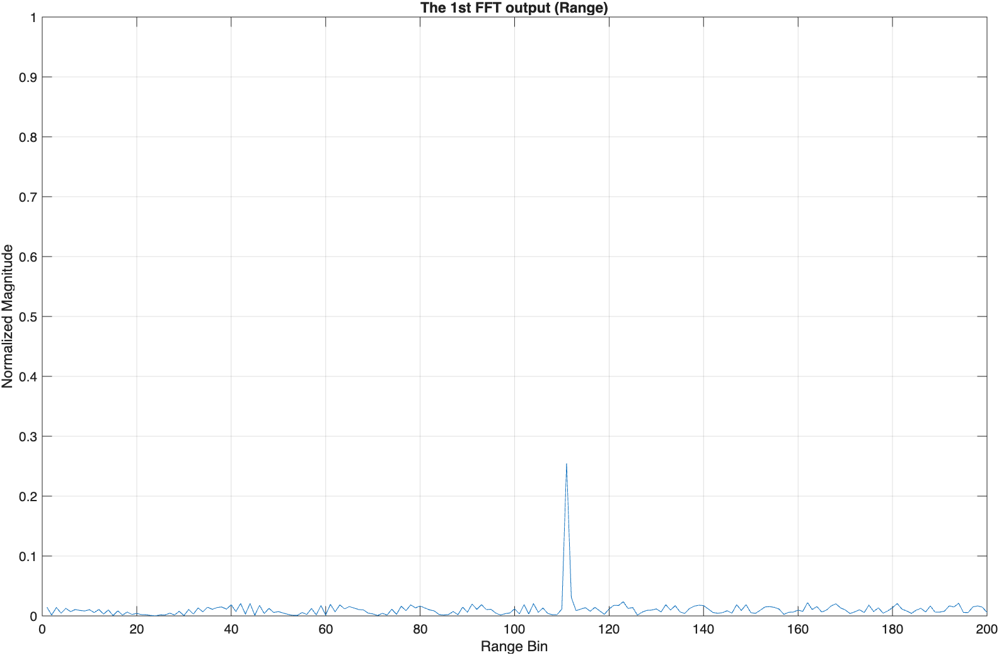

# FMCW Radar Target Generation and Detection

This repository contains a **MATLAB implementation of an FMCW radar signal processing pipeline** for automotive target detection. The project simulates radar target motion and performs **range and velocity estimation** using FFT-based processing and **2D CFAR detection**, following standard radar techniques used in autonomous driving systems.

**Author:** Bhagyath Badduri

---

## 📌 Project Overview

- FMCW radar waveform design based on system requirements  
- Target generation with constant velocity motion model  
- Beat signal generation from transmitted and received signals  
- **Range estimation using 1D FFT**  
- **Range–Doppler Map generation using 2D FFT**  
- **2D CFAR algorithm** for robust target detection  

---

## 📊 Results & Visualization

Instead of a video demo, the project results are demonstrated using **MATLAB-generated plots**, which clearly show radar detection performance at each stage of the pipeline.

### 🔹 Range from First FFT
This figure shows the range estimation obtained using a 1D FFT on the beat signal.

---

### 🔹 2D FFT Output – Range Doppler Map
This plot represents the **Range–Doppler Map**, where target range and velocity are simultaneously estimated.

---

### 🔹 2D CFAR Detection Output
This figure shows the final detection result after applying the **2D CFAR algorithm** to suppress noise and highlight the target.

---

## 🧠 Technical Concepts Used

- FMCW radar principles  
- Beat frequency analysis  
- Fast Fourier Transform (FFT)  
- Doppler processing for velocity estimation  
- Constant False Alarm Rate (CFAR) detection  

---

## 🛠️ Tools & Technologies

- MATLAB  
- Signal Processing techniques  
- Automotive FMCW radar theory (77 GHz)  

---

